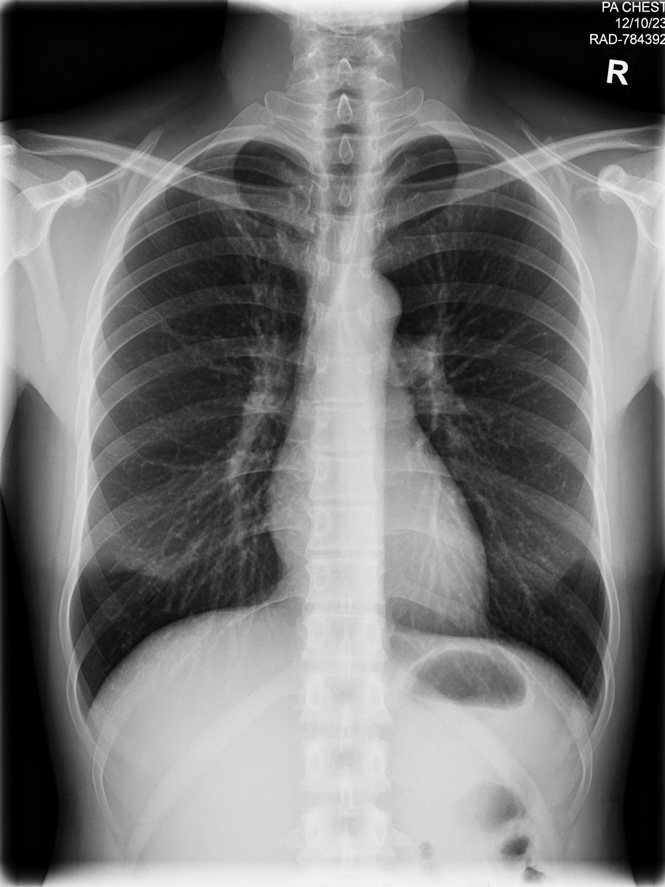
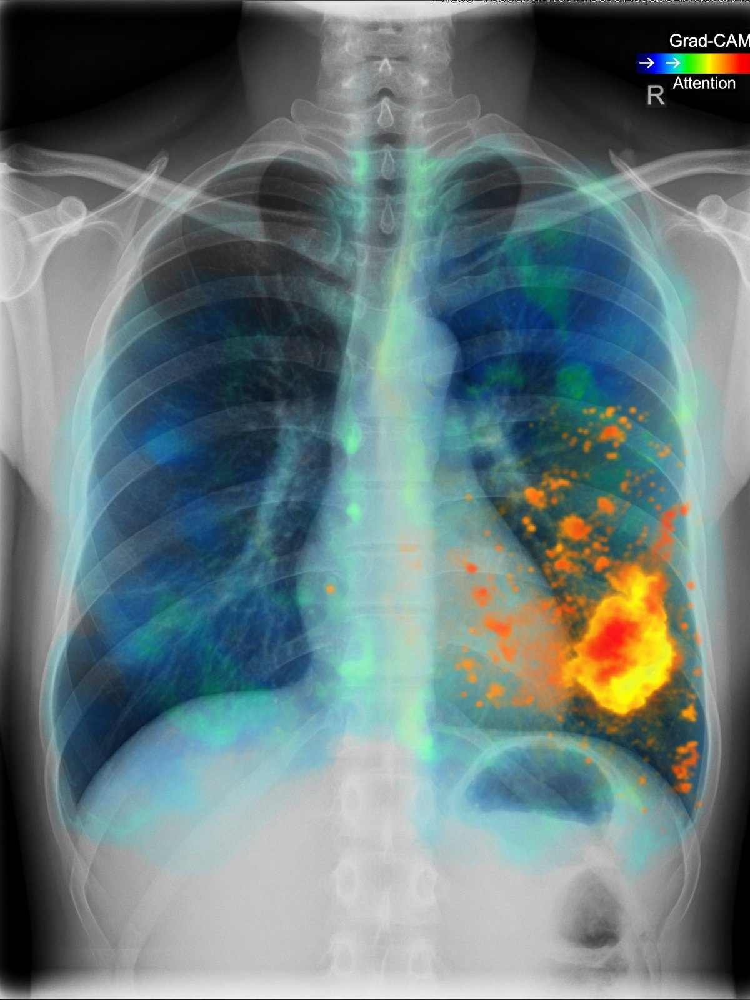

<div align="center">

# 🩻 MediScan AI

**Clinical-grade AI decision support for chest X-ray and CT diagnostics**

[](backend/)
[](backend/app/)
[](backend/app/models/)
[](frontend/)
[](frontend/src/)
[](frontend/src/)
[](docker-compose.yml)
[](docker-compose.yml)

Medical staff upload a chest X-ray or CT scan; the system runs a deep-learning
classifier, shows the diagnostic prediction with confidence, and overlays a
**Grad-CAM heatmap** highlighting the region of interest. Built around clinical
safety: PHI is stripped from DICOM metadata, scans are encrypted at rest, access
is role-based, and low-confidence results are surfaced loudly instead of hidden.

</div>

---

## Demo assets

| Login hero background | Sample chest X-ray | Grad-CAM heatmap example |
| --- | --- | --- |
|  |  |  |

> These demo assets are checked in under [`frontend/public/images/`](frontend/public/images/) and
> used by the UI for the login hero, demo scans, and explainability views.

---

## Table of contents

- [Overview & architecture](#overview--architecture)
- [Features](#features)
- [Tech stack](#tech-stack)
- [Quick start (local development)](#quick-start-local-development)
- [Demo accounts](#demo-accounts)
- [API overview](#api-overview)
- [Training a real model](#training-a-real-model-roadmap-steps-2--5)
- [Docker deployment](#docker-deployment-roadmap-step-6)
- [Repository layout](#repository-layout)
- [Security & compliance notes](#security--compliance-notes)
- [Testing](#testing)
- [Roadmap status](#roadmap-status)
- [Contributing](#contributing)
- [License](#license)

---

## Overview & architecture

```
┌─────────────┐   upload   ┌──────────────┐   inference   ┌──────────────────┐
│ React SPA   │ ─────────▶ │ FastAPI      │ ────────────▶ │ CNN + Grad-CAM   │
│ (MUI)       │  JWT/RBAC  │  /api/v1     │   decrypt     │ (or baseline     │
│             │ ◀───────── │  scans/      │ ◀───────────  │  heuristic)      │
│ heatmap     │  result +  │  predictions │   AES-256     │                  │
│ overlay     │  image     │  auth        │               └──────────────────┘
└─────────────┘            └──────────────┘
                                 │ SQLAlchemy (Postgres / SQLite)
                                 ▼
                           audits (no PHI)
```

## Features

- **Upload → predict → heatmap** loop with drag & drop upload (JPEG/PNG/DICOM),
  client-side validation, progress bars, and slow-inference feedback.
- **Grad-CAM explainability**: toggleable heatmap overlay with an opacity
  slider and side-by-side comparison (CNN engine) or a deterministic saliency
  map (baseline engine).
- **Security**: JWT auth with refresh tokens, RBAC (doctor/radiologist full
  access; staff upload-only + their own scans), AES-256 (Fernet) encryption at
  rest, DICOM PHI anonymization, structured audit logging without PHI.
- **Clinical safety UX**: predictions below the 70% confidence threshold are
  flagged, high-risk findings are emphasized, and doctors can flag results for
  review. Model selection during training prioritizes **sensitivity** (minimize
  false negatives).
- **Engine-agnostic inference**: the API uses a trained CNN when a
  `model.pth` state dict is present at `MODEL_PATH`. With the model missing
  and `ALLOW_HEURISTIC_FALLBACK=false` (the production default), prediction
  requests **fail loudly** rather than serve guessed diagnoses. A dev-only
  deterministic baseline heuristic is available for demos by explicitly
  setting `ALLOW_HEURISTIC_FALLBACK=true` — it is never used silently in
  production.

## Tech stack

| Layer | Technology |
| --- | --- |
| Frontend | React 19, TypeScript, Vite 7, Material UI v9, Tailwind CSS v4, Recharts, React Router v7, react-dropzone, notistack |
| Backend | FastAPI, SQLAlchemy 2 (async), Pydantic v2, Uvicorn |
| ML | PyTorch 2.2 (ResNet / EfficientNet / DenseNet transfer learning), Grad-CAM, NumPy-only evaluation metrics |
| Data | PostgreSQL 16 (production) / SQLite + aiosqlite (local dev) |
| Security | python-jose (JWT), bcrypt, cryptography (Fernet AES-256) |
| Infra | Docker, docker-compose, nginx (SPA + `/api` reverse proxy) |

---

## Quick start (local development)

### Prerequisites

- Python 3.11 or 3.12 (pinned `numpy==1.26.4` / `torch==2.2.1` don't support 3.13)
- Node.js 20+
- npm

### 1. Backend

```bash
cd backend
python -m venv .venv
# Windows: .venv\Scripts\activate     Linux/macOS: source .venv/bin/activate
pip install -r requirements.txt
cp .env.example .env

# backend/.env.example is pre-configured for local development out of the box:
#   ENVIRONMENT=development           # placeholder secrets are accepted in dev
#   DATABASE_URL=sqlite+aiosqlite:///./mediscan.db
#   MODEL_PATH=./models/model.pth     # the trained CNN shipped in the repo
#   ALLOW_HEURISTIC_FALLBACK=true     # dev baseline if the model is ever missing
#   SEED_DEMO_USERS=true              # doctor / radiologist / staff (DemoPass123!)

uvicorn app.main:app --reload --port 8000
```

* Interactive API docs: http://localhost:8000/docs
* Note: the required `JWT_SECRET_KEY`, `ENCRYPTION_KEY`, and `ENCRYPTION_SALT`
  values from `.env.example` are dev placeholders. In production the app
  **refuses to start** with placeholder secrets (`ENVIRONMENT=production` +
  a placeholder value → startup `ValueError`), so always generate strong
  random secrets before any real deployment.

### 2. Frontend

```bash
cd frontend
npm install
npm run dev        # http://localhost:5173
```

The Vite dev server proxies `/api` → `http://localhost:8000`, so the UI works
against a locally running backend out of the box (no CORS, no env vars). For
frontend-only work without a backend, run `VITE_DEMO_MODE=1 npm run dev` — the
app then falls back to bundled mock data with an unmissable **DEMO MODE**
banner. Demo fallback is off by default: without the flag, network errors are
surfaced instead of silently showing fabricated predictions.

### 3. Verify it works

1. Open http://localhost:5173, sign in as one of the [demo accounts](#demo-accounts).
2. Upload a chest X-ray (JPEG/PNG or DICOM) from the **Upload** page.
3. Open the result — you'll see the prediction, confidence meter, and the
   toggleable saliency/heatmap overlay.

## Demo accounts

> ⚠️ **Demo-user seeding is opt-in, never a production default.** The Docker
> stack defaults `SEED_DEMO_USERS=false`; the local-dev template
> (`backend/.env.example`) sets `SEED_DEMO_USERS=true`, and seeding also
> activates whenever `ENVIRONMENT` is not `production`. For the SIH demo,
> explicitly run `SEED_DEMO_USERS=true docker compose up`. Any public
> deployment must keep seeding off and provide real `JWT_SECRET_KEY` /
> `ENCRYPTION_KEY` / `ENCRYPTION_SALT` values — compose fails fast if they
> are missing.

The backend seeds these users when `SEED_DEMO_USERS=true` (explicit opt-in
for Docker; the local dev default) or when `ENVIRONMENT` is not `production`.
All passwords are `DemoPass123!`:

| Username | Role | Permissions |
| --- | --- | --- |
| `doctor` | Doctor | Full diagnostic access: upload, run predictions, flag for review, patient history |
| `radiologist` | Radiologist | Full diagnostic access, review queue |
| `staff` | Staff | Upload scans + view own scans only |

## API overview

All routes are prefixed with `/api/v1`. JWT access tokens are returned by
`POST /auth/login`.

| Endpoint | Auth | Description |
| --- | --- | --- |
| `POST /auth/login` | public | JWT + refresh token |
| `POST /auth/register` | doctor/radiologist | create user |
| `PATCH /auth/me` | any role | update own `email` / `full_name` only |
| `POST /auth/change-password` | any role | change own password (current password required) |
| `POST /scans/upload` | any role | upload scan (encrypted at rest) |
| `GET /scans/` | any role | list scans (staff: own only) |
| `POST /predictions/predict/{id}` | any role | run inference + Grad-CAM |
| `GET /predictions/` | any role | list predictions (staff: own only) |
| `POST /predictions/{id}/flag` | doctor/radiologist | flag for review |
| `GET /predictions/patient/{pid}/history` | doctor/radiologist | per-patient history |
| `GET /health` | public | engine / model status |

Example — login, then check engine status:

```bash
# Login
curl -s -X POST http://localhost:8000/api/v1/auth/login \
  -H "Content-Type: application/json" \
  -d '{"username":"doctor","password":"DemoPass123!"}'

# Health / engine status (public)
curl -s http://localhost:8000/api/v1/health
```

## Training a real model (roadmap steps 2 & 5)

The API serves the trained CNN as soon as a state dict exists at
`MODEL_PATH` (the repo ships with `model.pth`). To train or improve the
model, fine-tune a CNN and drop the resulting state dict at `MODEL_PATH`:

```bash
cd backend
.venv/Scripts/activate
# Folder layout (e.g. Kaggle chest_xray):
python -m app.models.train --data-dir ./data/chest_xray \
    --arch resnet50 --epochs 12 --batch-size 16 --output ./models/model.pth

# Evaluate on the held-out test split (reports sensitivity, specificity, AUC):
python -m app.models.evaluate --model ./models/model.pth --data-dir ./data/chest_xray

# Grad-CAM example overlays are written to ./evaluation_examples
```

Then restart the backend — `/api/v1/health` and the Settings page report
`"model_loaded": true`, and the CNN + real Grad-CAM engine takes over with no
code changes. See [`backend/app/models/README.md`](backend/app/models/README.md)
for dataset formats, CLI flags, and CSV (NIH-style) support.

## Docker deployment (roadmap step 6)

```bash
cp .env.example .env     # real secrets are REQUIRED — compose refuses to start without them
docker compose up --build
# SIH demo with well-known accounts: SEED_DEMO_USERS=true docker compose up --build
```

* `JWT_SECRET_KEY`, `ENCRYPTION_KEY`, and `ENCRYPTION_SALT` use the `:?`
  compose syntax: `docker compose up` **fails fast** if they are unset, so a
  misconfigured stack can never boot with forgeable JWTs or a decryptable key.
* Demo accounts are **not** seeded by default (`SEED_DEMO_USERS=false`).

* Frontend: http://localhost:8080 (nginx serves the SPA, proxies `/api`)
* Backend API: http://localhost:8000/docs (dev convenience mapping; remove
  the `BACKEND_PORT` mapping in production so the API is only reachable
  through the nginx proxy)
* Postgres is internal to the compose network; scans persist in named volumes.
* HTTPS/TLS: terminate at a reverse proxy / load balancer in front of the
  stack (`SSL_CERTFILE`/`SSL_KEYFILE` in the backend `.env` can also enable
  uvicorn TLS directly).
* The trained model is enabled by default: `model.pth` is bind-mounted
  read-only into the container from `./backend/models/`.
* If no model file is present and `ALLOW_HEURISTIC_FALLBACK` is unset/false,
  `/api/v1/health` reports `model_loaded: false` and prediction requests
  return a clear 500 (no fabricated diagnoses).

## Repository layout

```
backend/
  app/
    api/routes/      # auth, scans, predictions, health (FastAPI)
    core/            # config, security (JWT/encryption), logging
    db/              # SQLAlchemy models, session, seed
    services/        # image_processing (DICOM/PHI), model_inference (engines)
    models/          # TRAINING PIPELINE: metrics, data, train, evaluate
  tests/             # pytest suite (auth, RBAC, upload→predict→heatmap, metrics)
  Dockerfile         # python:3.11-slim
frontend/
  public/images/     # demo assets (login hero, sample scans, heatmap)
  src/               # React + MUI (pages, components, api client, theme)
  Dockerfile         # multi-stage: node:22 vite build → nginx:1.25
  nginx.conf         # SPA + /api proxy
docker-compose.yml   # postgres + backend + frontend
```

## Security & compliance notes

- **PHI anonymization**: DICOM files are de-identified with a **whitelist**
  (only safe tags + pixel data survive) and the *anonymized* file is what gets
  encrypted and stored — the original bytes never touch disk. Private/vendor
  tags and all patient identifiers are dropped.
- **Encryption**: uploaded scans **and derived images** (the `original_*.png` /
  `gradcam_*.png` renders) are encrypted with AES-256 (Fernet) at rest;
  decryption happens only transiently in memory while serving.
- **RBAC & object-level authorization**: doctor/radiologist = full diagnostic
  access; staff = upload + own scans only — enforced on scan listings,
  predictions, and image serving. Users can only edit `email`/`full_name` on
  their own account; role changes are doctor/radiologist-only.
- **Brute-force protection**: `POST /auth/login` is rate-limited per
  IP + username (5 failures / 15 min, in-process — swap for Redis/nginx when
  scaling horizontally).
- **Endpoint rate limiting**: upload and prediction endpoints are guarded by a
  per-user sliding window (`UPLOAD_RATE_LIMIT_PER_MINUTE` /
  `PREDICT_RATE_LIMIT_PER_MINUTE`, default 30/min) that returns 429 with
  `Retry-After` — an in-process store, adequate for the single-worker stack,
  replace with Redis when scaling horizontally.
- **Audit logging**: structured JSON logs of uploads, predictions, auth
  events, and flags — written to `AUDIT_LOG_PATH` and stdout, never containing
  PHI. Access logs record paths only, not query strings.
- This is **decision-support only**, not a final diagnosis. Production
  deployments require HTTPS/TLS, a HIPAA-aligned infrastructure review, and
  proper key management (never ship the `.env` from this repo).

## Testing

```bash
# Backend — 60 tests (validation, cleanup, security, RBAC, ML safety, rate limits, image-quality gate)
cd backend
.venv/Scripts/python -m pytest -q

# Frontend — typecheck + production build
cd ../frontend
npm run build
```

## Roadmap status

| Step | Status |
| --- | --- |
| 1. Dataset collection & preprocessing | Dataset loaders + transforms in `app/models/data.py` |
| 2. Model architecture & training | `app/models/train.py` (transfer learning, Grad-CAM) |
| 3. Web application | ✅ Complete (backend + frontend) |
| 4. Data security & privacy | ✅ PHI strip, AES-256 at rest, RBAC, audit logs |
| 5. Quality control & clinical validation | `app/models/evaluate.py` (sensitivity-focused metrics) |
| 6. Compliance & deployment | ✅ Dockerfile ×2 + docker-compose + TLS at proxy |

## Contributing

1. Fork the repo and create a feature branch (`git checkout -b feat/my-change`).
2. Make your changes — keep the [testing](#testing) suite green.
3. Commit with a clear message and open a pull request.

Before opening a PR, please run the backend tests and the frontend build
locally, and do **not** commit real secrets, `.env` files, datasets, or
uploaded scans — those are gitignored.

> ⚠️ **Model checkpoints are intentionally tracked.** Unlike datasets, the
> trained CNN (`backend/models/model.pth` + summary/evaluation JSON) ships
> with the repo because the API fails loudly without it (see
> [Testing](#testing) and [Training a real model](#training-a-real-model-roadmap-steps-2--5)).
> Only add *new* retrained checkpoints when they are meant to ship with the
> product; keep experimental weights out of the repository.

## License

This project is not yet published under an open-source license. All rights
reserved. Contact the maintainers before using or distributing this code.
