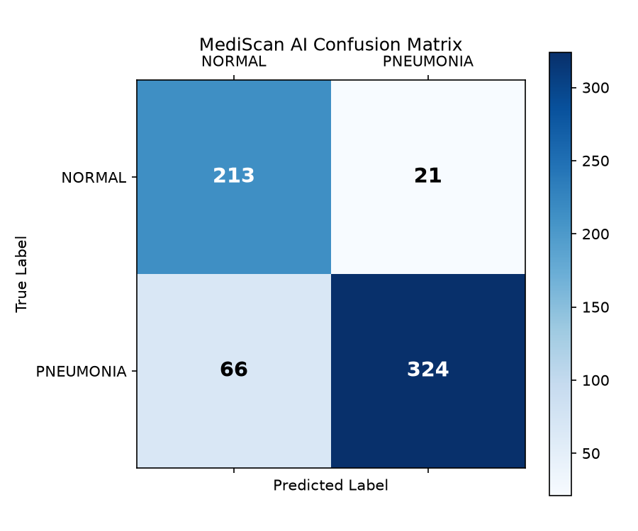
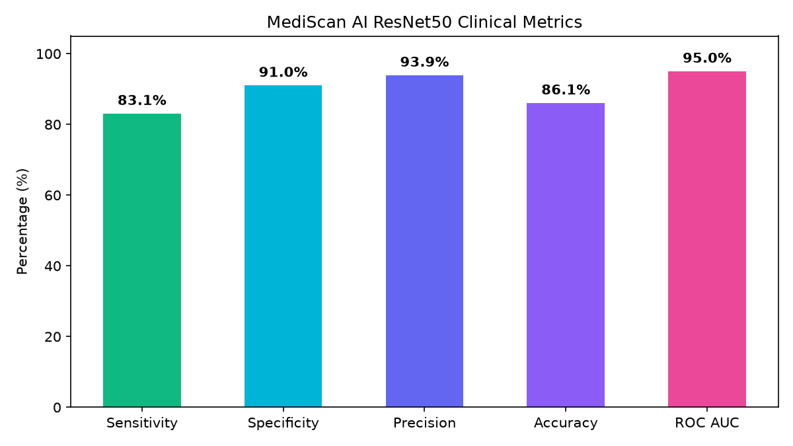

# MediScan AI — Clinical Model Evaluation Report

**Model Architecture**: ResNet50 (Transfer Learning)  
**Evaluated Dataset**: Real Kaggle Chest X-Ray Hold-Out Test Set (624 samples)  
**Positive (Abnormal) Class**: Pneumonia  

---

## 📊 Clinical Summary Metrics

| Clinical Metric | Score | Percentage |
| :--- | :--- | :--- |
| **Accuracy** | `0.8606` | **86.06%** |
| **Balanced Accuracy** | `0.8705` | **87.05%** |
| **Sensitivity (Recall)** | `0.8308` | **83.08%** |
| **Specificity** | `0.9103` | **91.03%** |
| **Precision** | `0.9391` | **93.91%** |
| **F1 Score** | `0.8816` | **88.16%** |
| **ROC AUC** | `0.9503` | **95.03%** |

---

## 📉 Confusion Matrix

| Actual \ Predicted | Predicted NORMAL | Predicted PNEUMONIA | Total |
| :--- | :--- | :--- | :--- |
| **Actual NORMAL** | **213** (True Negatives) | **21** (False Positives) | 234 |
| **Actual PNEUMONIA** | **66** (False Negatives) | **324** (True Positives) | 390 |

---

## 📸 Generated Visual Charts
- 
- 
